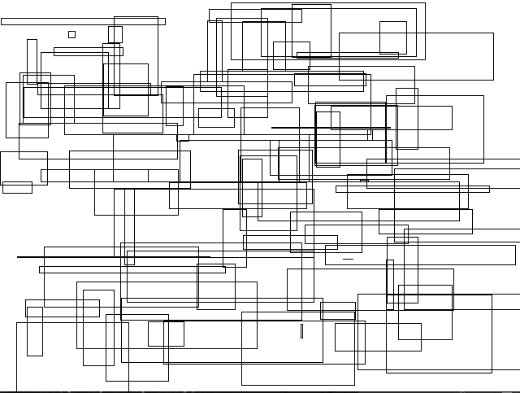
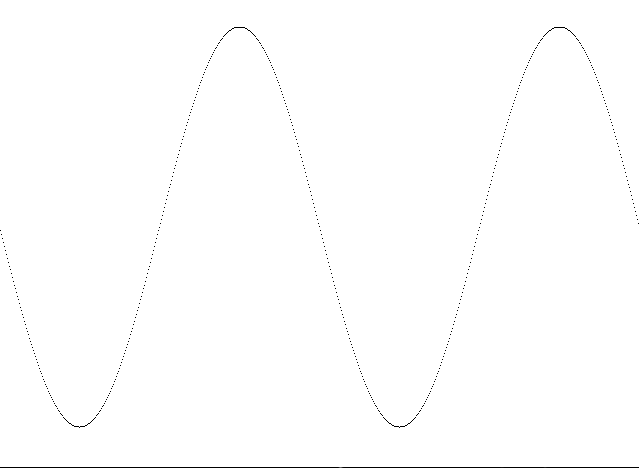
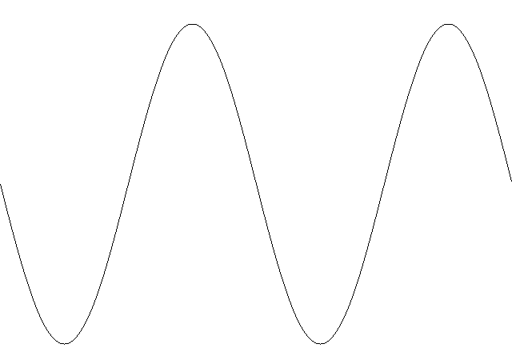
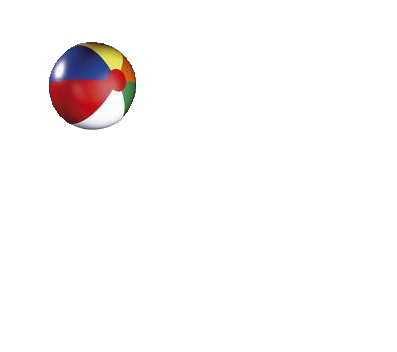
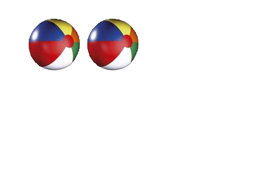
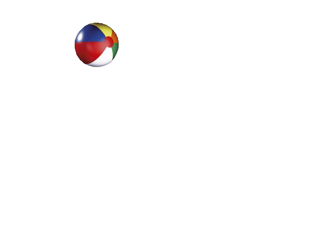
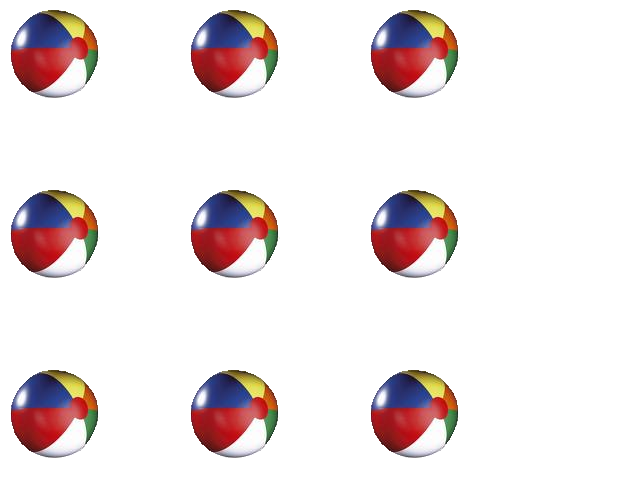

# Pygame

## 1.寻求帮助

​	安装Pygame，Numeric

## 2.Pygame窗口

### 准备画布

```python
import pygame
pygame.init()
screen = pygame.display.set_mode([640, 480])
while True:
    pass
```

### 更好地结束

```python
import pygame, sys
pygame.init()
screen = pygame.display.set_mode([640, 480])
while True:
    for event in pygame.event.get():
        if event.type == pygame.QUIT:
            sys.exit()
```

## 3.画图

```python
import pygame, sys
pygame.init()
screen = pygame.display.set_mode([640, 480])
screen.fill([255, 255, 255])  # 用白色背景填充画布
pygame.draw.circle(screen, [255, 0, 0], [100, 100], 30, 0)  # 画一个圆
pygame.display.flip()  # 翻转
while True:
    for event in pygame.event.get():
        if event.type == pygame.QUIT:
            sys.exit()
```

### 如何画一个圆

pygame.draw.circle()+5件事

- 在定义好的画布上画
- 用什么颜色画，红色[255, 0, 0]
- 在画布的哪个位置上画[100, 100]，左上角为原点向下和向右各100个像素
- 圆的大小30像素（这里指圆的半径）
- 线宽0像素（width = 0，圆是完全填充的；可以改变数值比较一下）

#### 知识拓展：

像素：Picture element图像元素，把屏幕上的图像放大到最大，会看到单个的像素

分辨率：1024 × 768，1366 × 768，...

画布：Pygame可以有多个画布，可以把图像从一个画布复制到另一个画布。“翻转”显示图像。

颜色：RGB，红、绿、蓝 colordict.py看到底有多少颜色

```python
from pygame.color import THECOLORS
pygame.draw.circle(screen, THECOLORS["red"], [100, 100], 30, 10)  # 画一个圆
```

位置——屏幕坐标：左上角坐标；x，横轴；y，纵轴

形状大小：rect(left, top, width, heigh)，左上角坐标、宽和高

```python
# 1.
pygame.draw.rect(screen, [R, G, B], [xxx, xxx, xxx, xxx], x)
# 2.
my_list = [xxx, xxx, xxx, xxx]
pygame.draw.rect(screen, [R, G, B], my_list, x)
# 3.
my_rect = pygame.Rect(xxx, xxx, xxx, xxx)  # Rect
pygame.draw.rect(screen, [R, G, B], my_rect, x)
```

### 创作：天马行空

```python
import pygame, sys, random
pygame.init()
screen = pygame.display.set_mode([640, 480])
screen.fill([255, 255, 255])
for i in range(100):
    width = random.randint(0, 250)
    height = random.randint(0, 100)
    top = random.randint(0, 400)
    left = random.randint(0, 500)
    pygame.draw.rect(screen, [0, 0, 0], [left, top, width, height], 1)
pygame.display.flip()
while True:
    for event in pygame.event.get():
        if event.type == pygame.QUIT:
            sys.exit()
```



```python
import pygame, sys, random
from pygame.color import THECOLORS
pygame.init()
screen = pygame.display.set_mode([640, 480])
screen.fill([255, 255, 255])
for i in range(100):
    width = random.randint(0, 250)
    height = random.randint(0, 100)
    top = random.randint(0, 400)
    left = random.randint(0, 500)
    color_name = random.choice(THECOLORS.keys())
    color = THECOLORS[color_name]
    line_width = random.randint(1, 3)
    pygame.draw.rect(screen, color, [left, top, width, height], line_width)
pygame.display.flip()
while True:
    for event in pygame.event.get():
        if event.type == pygame.QUIT:
            sys.exit()
```


## 4.单个像素

```python
import pygame, sys
import math
pygame.init()
screen = pygame.display.set_mode([640, 480])
screen.fill([255, 255, 255])
for x in range(0, 640):
    y = int(math.sin(x/640.0 * 4 * math.pi) * 200 + 240)
    pygame.draw.rect(screen, [0, 0, 0], [x, y, 1, 1], 1)
pygame.display.flip()
while True:
    for event in pygame.event.get():
        if event.type == pygame.QUIT:
            sys.exit()
```



### 连接多个点

- surface
- color
- 是否首尾连接闭合（closed），不闭合False
- 要连接的点的列表（list）
- 线宽（width）

```python
import pygame, sys
import math
pygame.init()
screen = pygame.display.set_mode([640, 480])
screen.fill([255, 255, 255])
for x in range(0, 640):
    y = int(math.sin(x/640.0 * 4 * math.pi) * 200 + 240)
    plotPoints.append([x, y])
pygame.draw.lines(screen, [0, 0, 0], False, plotPoints, 1)
pygame.display.flip()
while True:
    for event in pygame.event.get():
        if event.type == pygame.QUIT:
            sys.exit()
```



### 再来连接多个点

```python
import pygame, sys
pygame.init()
dots = [[221, 432], [225, 331], [133, 342], [141, 310],
        [51, 230], [74, 217], [58, 153], [114, 164],
        [123, 135], [176, 190], [159, 77], [193, 93],
        [230, 28], [267, 93], [301, 77], [284, 190],
        [327, 135], [336, 164], [402, 153], [386, 217],
        [409, 230], [319, 310], [327, 342], [233, 331],
        [237, 432]]
screen = pygame.display.set_mode([640, 480])
screen.fill([255, 255, 255])
pygame.draw.lines(screen, [255, 0, 0], True, dots, 2)
pygame.display.flip()
while True:
    for event in pygame.event.get():
        if event.type == pygame.QUIT:
            sys.exit()
```


### 逐点绘制

```python
import pygame, sys
import math
pygame.init()
screen = pygame.display.set_mode([640, 480])
screen.fill([255, 255, 255])
for x in range(0, 640):
    y = int(math.sin(x/640.0 * 4 * math.pi) * 200 + 240)
#    pygame.draw.rect(screen, [0, 0, 0], [x, y, 1, 1], 1)
	
    # 只想改变一个像素的颜色，画一个小圆或矩形就会有点傻
    # Surface.set_at()访问一个画布上的单个像素，可设置颜色
    screen.set_at([x, y], [0, 0, 0])

# 检查一个像素设置了什么颜色    
pixel_color = screen.get_at([320, 240])
print pixel_color
pygame.display.flip()
while True:
    for event in pygame.event.get():
        if event.type == pygame.QUIT:
            sys.exit()
```

## 5.图像

```python
import pygame, sys
pygame.init()
screen = pygame.display.set_mode([640, 480])
screen.fill([255, 255, 255])
my_ball = pygame.image.load("beach_ball.png")
screen.blit(my_ball, [50, 50])
pygame.display.flip()
while True:
    for event in pygame.event.get():
        if event.type == pygame.QUIT:
            sys.exit()
```



## 6.让图像动起来

```python
import pygame, sys
pygame.init()
screen = pygame.display.set_mode([640, 480])
screen.fill([255, 255, 255])
my_ball = pygame.image.load("beach_ball.png")
screen.blit(my_ball, [50, 50])
pygame.display.flip()
pygame.time.delay(2000)
screen.blit(my_ball, [150, 50])
pygame.display.flip()
while True:
    for event in pygame.event.get():
        if event.type == pygame.QUIT:
            sys.exit()
```



## 7.动画

- 在新的位置上画出图形
- 把原来的图形擦掉

```python
import pygame, sys
pygame.init()
screen = pygame.display.set_mode([640, 480])
screen.fill([255, 255, 255])
my_ball = pygame.image.load("beach_ball.png")
screen.blit(my_ball, [50, 50])
pygame.display.flip()
pygame.time.delay(2000)
screen.blit(my_ball, [150, 50])

# 用白色矩形盖住原来的图形
pygame.draw.rect(screen, [255, 255, 255], [50, 50, 90, 90], 0)
pygame.display.flip()
while True:
    for event in pygame.event.get():
        if event.type == pygame.QUIT:
            sys.exit()
```



让球动起来

```python
import pygame, sys
pygame.init()									# 初始化
screen = pygame.display.set_mode([640, 480])	# 画布
screen.fill([255, 255, 255])					# 白色背景
my_ball = pygame.image.load('beach_ball.png')	# 调图
x = 50
y = 50
screen.blit(my_ball, [x, y])					# 按坐标上图
pygame.display.flip()							# 翻转，好象合成
for looper in range(1, 100):					# 重复99次
	pygame.time.delay(20)						# 每次间隔20个时间单位
	pygame.draw.rect(screen, [255, 255, 255], [x, y, 90, 90], 0)
    											# 用白色矩形盖住球
	x = x + 5									# 球的原点横坐标加5个像素
	screen.blit(my_ball, [x, y])				# 按新坐标上图			
	pygame.display.flip()
while True:
	for event in pygame.event.get():
		if event.type == pygame.QUIT:
			sys.exit()
```

让球一直动

```python
# 球碰到边框横向来回反弹
# 分析：左边界，x=0；右边界，x=640-90=550
# 让球一直反弹，并加速
import pygame, sys
pygame.init()
screen = pygame.display.set_mode([640, 480])
screen.fill([255, 255, 255])
my_ball = pygame.image.load('beach_ball.png')
x = 50
y = 50
x_speed = 10
while True:
	for event in pygame.event.get():
		if event.type == pygame.QUIT:
			sys.exit()
	pygame.time.delay(20)
	pygame.draw.rect(screen, [255, 255, 255], [x, y, 90, 90], 0)
	x = x + x_speed								# 球加速，原来移到5个单位，现在10个单位
	if x > screen.get_width() - 90 or x < 0:	# 判断球是否碰到边界
		x_speed = - x_speed						# 碰到边界球就反弹
	screen.blit(my_ball, [x, y])
	pygame.display.flip()
```

```python
# 球会上下左右反弹
import pygame, sys
pygame.init()
screen = pygame.display.set_mode([640, 480])
screen.fill([255, 255, 255])
my_ball = pygame.image.load('beach_ball.png')
x = 50
y = 50
x_speed = 10
y_speed = 10
while True:
	for event in pygame.event.get():
		if event.type == pygame.QUIT:
			sys.exit()
	pygame.time.delay(20)
	pygame.draw.rect(screen, [255, 255, 255], [x, y, 90, 90], 0)
	x = x + x_speed
	y = y + y_speed
	if x > screen.get_width() - 90 or x < 0:
		x_speed = - x_speed
	if y > screen.get_height() - 90 or y < 0:
		y_speed = - y_speed
	screen.blit(my_ball, [x, y])
	pygame.display.flip()
```

```python
# 让球成走马灯：向右跑出右边界后从左边界出来
import pygame, sys
pygame.init()
screen = pygame.display.set_mode([640, 480])
screen.fill([255, 255, 255])
my_ball = pygame.image.load('beach_ball.png')
x = 50
y = 50
x_speed = 5
while True:
	for event in pygame.event.get():
		if event.type == pygame.QUIT:
			sys.exit()
	pygame.time.delay(20)
	pygame.draw.rect(screen, [255, 255, 255], [x, y, 90, 90], 0)
	x = x + x_speed
	if x > screen.get_width():					# 当球原点跑出右边界时
		x = -90									# 球回到左边界重新向右移动
        										# 注意是球的右上角x=0
	screen.blit(my_ball, [x, y])
	pygame.display.flip()
```

### 动画精灵sprite

四处移动的单个图像或图像部分称为动画精灵，Pygame有一个特殊的模块来处理动画精灵。利用这个模块，我们可以更容易地移动图形对象。

两个基本属性：

- 图像image：为动画精灵显示的图片
- 矩形区rect：包含动画精灵的矩形区域

```python
# 动画精灵子类
import pygame, sys
class MyBallClass(pygame.sprite.Sprite):
"""
精灵子类：
"""
	def __init__(self, image_file, location):
    """
    初始化精灵：
    	取图 pygame.image.load(image_file)
    	定框 self.image.get_rect()
    	定位 location
    """
		pygame.sprite.Sprite.__init__(self)
		self.image = pygame.image.load(image_file)
		self.rect = self.image.get_rect()				# 定义图像边界的矩形
		self.rect.left, self.rect.top = location		# 球的初始位置
size = width, height = 640, 480							# 列表和整形变量
screen = pygame.display.set_mode(size)
screen.fill([255, 255, 255])
img_file = "beach_ball.png"
balls = []
for row in range(0, 3):
	for column in range(0, 3):
		location = [column * 180 + 10, row * 180 + 10]	# 每次位置不同
		ball = MyBallClass(img_file, location)			# 在一个位置准备一个球
		balls.append(ball)								# 把球放到列表
	for ball in balls:									# 从列表取球
		screen.blit(ball.image, ball.rect)				# 上图，即球
	pygame.display.flip()								# 成像，固定步骤
while True:
	for event in pygame.event.get():
		if event.type == pygame.QUIT:sys.exit()
```



一堆沙滩球都反弹

```python
# -*- coding:UTF-8 -*-
# 从此要开始习惯长代码了
# 动画精灵子类
import pygame, sys
from random import *
#--------ball subclass definition-------------------------
class MyBallClass(pygame.sprite.Sprite):
	def __init__(self, image_file, location, speed):
		pygame.sprite.Sprite.__init__(self)
		self.image = pygame.image.load(image_file)
		self.rect = self.image.get_rect()
		self.rect.left, self.rect.top = location
		self.speed = speed									# 增加移动速度属性
	
	def move(self):										
		self.rect = self.rect.move(self.speed)				# 定框
		if self.rect.left < 0 or self.rect.right > width:	# 判断
			self.speed[0] = -self.speed[0]					# 反弹
		
		if self.rect.top < 0 or self.rect.bottom > height:
			self.speed[1] = -self.speed[1]

#--------main program--------------------------------------
size = width, height = 640, 480
screen = pygame.display.set_mode(size)
screen.fill([255, 255, 255])
img_file = "beach_ball.png"
balls = []
for row in range(0, 3):
	for column in range(0, 3):
		location = [column * 180 + 10, row * 180 + 10]
		speed = [choice([-2, 2]), choice([-2, 2])]
		ball = MyBallClass(img_file, location, speed)		# 实例化若干个球
		balls.append(ball)									# 放到列表

while True:
	for event in pygame.event.get():
		if event.type == pygame.QUIT:sys.exit()
	pygame.time.delay(20)
    # 捷径：并不是单独地“擦除”（覆盖）各个球，直接用白色填充画布，再重绘所有球
	screen.fill([255, 255, 255])							# 重绘屏幕？
	for ball in balls:
		ball.move()											# 球动起来
		screen.blit(ball.image, ball.rect)					# 不断地盖
	pygame.display.flip()
```

## 9.碰撞检测collision detection

了解两个动画精灵何时接触或重叠。两个移动的东西相互碰到一起就是一个碰撞。

```python
import pygame, sys
from random import *
#--------ball subclass definition-------------------------
class MyBallClass(pygame.sprite.Sprite):
	def __init__(self, image_file, location, speed):
		pygame.sprite.Sprite.__init__(self)
		self.image = pygame.image.load(image_file)
		self.rect = self.image.get_rect()
		self.rect.left, self.rect.top = location
		self.speed = speed
	
	def move(self):
		self.rect = self.rect.move(self.speed)
		if self.rect.left < 0 or self.rect.right > width:
			self.speed[0] = -self.speed[0]
		
		if self.rect.top < 0 or self.rect.bottom > height:
			self.speed[1] = -self.speed[1]

def animate(group):
	screen.fill([255, 255, 255])
	for ball in group:
		group.remove(ball) # 从组删除精灵
        # 检查精灵与组之间的碰撞
		if pygame.sprite.spritecollide(ball, group, False):
			ball.speed[0] = -ball.speed[0]
			ball.speed[1] = -ball.speed[1]
		# 将球再添加回原来的组中
        group.add(ball)
		ball.move()
		screen.blit(ball.image, ball.rect)
	pygame.display.flip()
	pygame.time.delay(20)
#--------main program--------------------------------------
size = width, height = 640, 480
screen = pygame.display.set_mode(size)
screen.fill([255, 255, 255])
img_file = "beach_ball.png"
group = pygame.sprite.Group() # 创建精灵组
for row in range(0, 2):
	for column in range(0, 2):
		location = [column * 180 + 10, row * 180 + 10]
		speed = [choice([-2, 2]), choice([-2, 2])]
		ball = MyBallClass(img_file, location, speed)
		group.add(ball) # 将各个球增加到组

while True:
	for event in pygame.event.get():
		if event.type == pygame.QUIT:sys.exit()
	animate(group) # 调用animate()并传入group
```

spritecollide()函数：会查找一个精灵与一个组中所有精灵之间的碰撞。3个步骤：

- 首先，从这个组中删除这个精灵
- 其次，检查这个精灵与组中其它精灵之间的碰撞
- 最后，再把这个精灵添加回原来的组中

趣点：把速度加到5，延迟加到50，这时有奇怪的行为：

- 球碰撞时，它们会“颤抖”或者发生再次碰撞
- 有时球会“卡”在边界上，颤抖一段时间

这是因为animate()函数有关：先移动一个球，检查它的碰撞，然后移动另一个球，再检查这个球的碰撞，依此类推。也许应该先完成所有移动，然后再完成全部碰撞检测。所以把ball.move()放在它自己的循环中

```python
def animate(group):
	screen.fill([255, 255, 255])
	for ball in group:
		ball.move()
	for ball in group:
		group.remove(ball)
		if pygame.sprite.spritecollide(ball, group, False):
			ball.speed[0] = -ball.speed[0]
			ball.speed[1] = -ball.speed[1]
		group.add(ball)
		screen.blit(ball.image, ball.rect)
	pygame.display.flip()
	pygame.time.delay(50)
```

### 统计时间

```python
import pygame, sys
from random import *
#--------ball subclass definition-------------------------
class MyBallClass(pygame.sprite.Sprite):
	def __init__(self, image_file, location, speed):
		pygame.sprite.Sprite.__init__(self)
		self.image = pygame.image.load(image_file)
		self.rect = self.image.get_rect()
		self.rect.left, self.rect.top = location
		self.speed = speed
	
	def move(self):
		self.rect = self.rect.move(self.speed)
		if self.rect.left < 0 or self.rect.right > width:
			self.speed[0] = -self.speed[0]
		
		if self.rect.top < 0 or self.rect.bottom > height:
			self.speed[1] = -self.speed[1]

def animate(group):
	screen.fill([255, 255, 255])
	for ball in group:
		ball.move()
	for ball in group:
		group.remove(ball)
		if pygame.sprite.spritecollide(ball, group, False):
			ball.speed[0] = -ball.speed[0]
			ball.speed[1] = -ball.speed[1]
		group.add(ball)
		screen.blit(ball.image, ball.rect)
	pygame.display.flip()
	# pygame.time.delay(50) # 已经删除time.delay()
#--------main program--------------------------------------
# 初始化并画出沙滩球
size = width, height = 640, 480
screen = pygame.display.set_mode(size)
screen.fill([255, 255, 255])
img_file = "beach_ball.png"
clock = pygame.time.Clock() # 创建Clock实例
group = pygame.sprite.Group()
for row in range(0, 2):
	for column in range(0, 2):
		location = [column * 180 + 10, row * 180 + 10]
		speed = [choice([-5, 5]), choice([-5, 5])]
		ball = MyBallClass(img_file, location, speed)
		group.add(ball)

# while True:
while 1:
	for event in pygame.event.get():
		if event.type == pygame.QUIT:
			frame_rate = clock.get_fps() # 检查帧速率
			print "frame rate = ", frame_rate
			sys.exit()
	animate(group)
	clock.tick(30) # 控制帧速率（受计算机速度限制）
# frame rate =  30.2114810944
```

